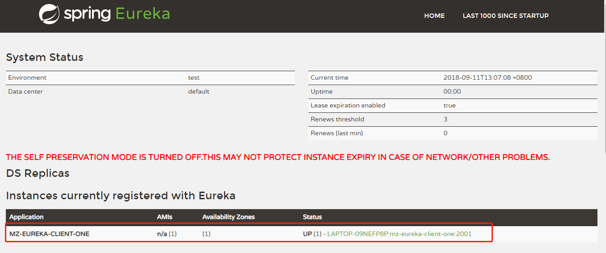

## Spring Cloud构建微服务架构（一）服务注册与发现

### ***服务注册与发现***

在简单介绍了Spring Cloud和微服务架构之后，下面回归本文的主旨内容，如何使用Spring Cloud搭建服务注册与发现模块。

这里我们会用到[Spring Cloud Netflix](https://cloud.spring.io/spring-cloud-netflix/)，该项目是Spring Cloud的子项目之一，主要内容是对Netflix公司一系列开源产品的包装，它为Spring Boot应用提供了自配置的Netflix OSS整合。通过一些简单的注解，开发者就可以快速的在应用中配置一下常用模块并构建庞大的分布式系统。它主要提供的模块包括：服务发现（Eureka），断路器（Hystrix），智能路有（Zuul），客户端负载均衡（Ribbon）等。

所以，我们这里的核心内容就是服务发现模块：Eureka。下面我们动手来做一些尝试。

#### ***创建“服务注册中心”***

创建一个基础的Spring Boot工程 mz-eureka-server，并在`pom.xml`中引入需要的依赖内容：

```xml
  	<!-- 引入README.md 中构建的父项目-->
	<parent>
        <artifactId>SpringCloud-Learning</artifactId>
        <groupId>com.mz</groupId>
        <version>1.0.0</version>
    </parent>
	
    <dependencies>
    	<!-- 引入 eureka server 依赖-->
        <dependency>
            <groupId>org.springframework.cloud</groupId>
            <artifactId>spring-cloud-starter-netflix-eureka-server</artifactId>
        </dependency>
    </dependencies>
```

通过`@EnableEurekaServer`注解启动一个服务注册中心提供给其他应用进行对话。这一步非常的简单，只需要在一个普通的Spring Boot应用中添加这个注解就能开启此功能，比如下面的例子：

```java
@EnableEurekaServer
@SpringBootApplication
public class EurekaServerApplication {
    public static void main(String[] args) {
        SpringApplication.run(EurekaServerApplication.class, args);
    }
}
```

在默认设置下，该服务注册中心也会将自己作为客户端来尝试注册它自己，所以我们需要禁用它的客户端注册行为，只需要在`bootstrap.yml`中问增加如下配置：

```yaml
server:
  port: 1001

spring:
  application:
    name: mz-eureka-server

eureka:
  client:
    fetch-registry: false
    register-with-eureka: false
    serviceUrl:
      defaultZone: http://${eureka.instance.hostname}:${server.port}/eureka/
  instance:
    hostname: localhost
  server:  #配置属性，但由于 Eureka 自我保护模式以及心跳周期长的原因，经常会遇到 Eureka Server 不剔除已关停的节点的问题
    enable-self-preservation: false
    eviction-interval-timer-in-ms: 5000
```

为了与后续要进行注册的服务区分，这里将服务注册中心的端口通过`server.port`属性设置为`1001`。

启动工程后，访问：<http://localhost:1001/> 可以看见如下界面：


#### ***创建“服务提供方”***

下面我们创建提供服务的客户端，并向服务注册中心注册自己。

假设我们有一个提供计算功能的微服务模块，我们实现一个RESTful API，通过传入两个参数a和b，最后返回a + b的结果。

首先，创建一个基本的Spring Boot应用，在`pom.xml`中，加入如下配置：

```xml
    <parent>
        <artifactId>SpringCloud-Learning</artifactId>
        <groupId>com.mz</groupId>
        <version>1.0.0</version>
    </parent>

    <dependencies>
        <dependency>
            <groupId>org.springframework.cloud</groupId>
            <artifactId>spring-cloud-starter-netflix-eureka-client</artifactId>
        </dependency>
        <dependency>
            <groupId>org.springframework.boot</groupId>
            <artifactId>spring-boot-starter-web</artifactId>
        </dependency>
    </dependencies>
```

其次，实现`/hi`请求处理接口。

```java
@RestController
public class HelloController {

    @RequestMapping("hi")
    public String sayHi() {
        return "Hi Spring Cloud";
    }
}
```

最后在主类中通过加上`@EnableDiscoveryClient`注解，该注解能激活Eureka中的`DiscoveryClient`实现，才能实现Controller中对服务信息的输出。

```java
@EnableDiscoveryClient
@SpringBootApplication
public class EurekaClientOneApplication {

    public static void main(String[] args) {
        SpringApplication.run(EurekaClientOneApplication.class, args);
    }
}
```

我们在完成了服务内容的实现之后，再继续对`bootstrap.yml`做一些配置工作，具体如下：

```properties
eureka:
    client:
        serviceUrl:
            defaultZone: http://localhost:1001/eureka/
server:
    port: 2001
spring:
    application:
        name: mz-eureka-client-one
```

通过`spring.application.name`属性，我们可以指定微服务的名称后续在调用的时候只需要使用该名称就可以进行服务的访问。

`eureka.client.serviceUrl.defaultZone`属性对应服务注册中心的配置内容，指定服务注册中心的位置。

为了在本机上测试区分服务提供方和服务注册中心，使用`server.port`属性设置不同的端口。

启动该工程后，再次访问：<http://localhost:1001/>

可以看到，我们定义的服务被注册了。



访问： <http://localhost:2001/hi> 看到接口的响应

