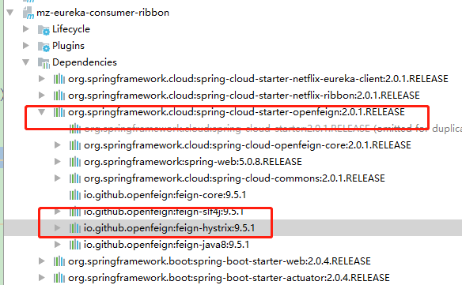

# Spring Cloud（七）服务监控Hystrix

## 熔断器

### 雪崩效应

在微服务架构中通常会有多个服务层调用，基础服务的故障可能会导致级联故障，进而造成整个系统不可用的情况，这种现象被称为服务雪崩效应。服务雪崩效应是一种因“服务提供者”的不可用导致“服务消费者”的不可用,并将不可用逐渐放大的过程。

如果下图所示：A作为服务提供者，B为A的服务消费者，C和D是B的服务消费者。A不可用引起了B的不可用，并将不可用像滚雪球一样放大到C和D时，雪崩效应就形成了。


### 熔断器（CircuitBreaker）

熔断器的原理很简单，如同电力过载保护器。它可以实现快速失败，如果它在一段时间内侦测到许多类似的错误，会强迫其以后的多个调用快速失败，不再访问远程服务器，从而防止应用程序不断地尝试执行可能会失败的操作，使得应用程序继续执行而不用等待修正错误，或者浪费CPU时间去等到长时间的超时产生。熔断器也可以使应用程序能够诊断错误是否已经修正，如果已经修正，应用程序会再次尝试调用操作。

熔断器模式就像是那些容易导致错误的操作的一种代理。这种代理能够记录最近调用发生错误的次数，然后决定使用允许操作继续，或者立即返回错误。 熔断器开关相互转换的逻辑如下图：


熔断器就是保护服务高可用的最后一道防线。

## Hystrix 特性

对于熔断这个功能，Spring Cloud  为我们提供的 Hystrix 提供了这一动能，包含以下几点特性：

**1.断路器机制**

断路器很好理解, 当Hystrix Command请求后端服务失败数量超过一定比例(默认50%), 断路器会切换到开路状态(Open). 这时所有请求会直接失败而不会发送到后端服务. 断路器保持在开路状态一段时间后(默认5秒), 自动切换到半开路状态(HALF-OPEN). 这时会判断下一次请求的返回情况, 如果请求成功, 断路器切回闭路状态(CLOSED), 否则重新切换到开路状态(OPEN). Hystrix的断路器就像我们家庭电路中的保险丝, 一旦后端服务不可用, 断路器会直接切断请求链, 避免发送大量无效请求影响系统吞吐量, 并且断路器有自我检测并恢复的能力.

**2.Fallback**

Fallback相当于是降级操作. 对于查询操作, 我们可以实现一个fallback方法, 当请求后端服务出现异常的时候, 可以使用fallback方法返回的值. fallback方法的返回值一般是设置的默认值或者来自缓存.

**3.资源隔离**

在Hystrix中, 主要通过线程池来实现资源隔离. 通常在使用的时候我们会根据调用的远程服务划分出多个线程池. 例如调用产品服务的Command放入A线程池, 调用账户服务的Command放入B线程池. 这样做的主要优点是运行环境被隔离开了. 这样就算调用服务的代码存在bug或者由于其他原因导致自己所在线程池被耗尽时, 不会对系统的其他服务造成影响. 但是带来的代价就是维护多个线程池会对系统带来额外的性能开销. 如果是对性能有严格要求而且确信自己调用服务的客户端代码不会出问题的话, 可以使用Hystrix的信号模式(Semaphores)来隔离资源。

## 项目中使用 Hystrix 

我们之前讲述客户端负载均衡Ribbon 与 服务间调用Feign 时，创建的 `mz-eureka-consumer-ribbon` 中引入了 openFeign 这个依赖，这个依赖其实已经包含了 Hystrix ,如图：



所以我们不需要改动任何依赖，只需要对Feign调用进心改造即可，改造跟为三步：

​	1、创建 class 实现之前的 FeignClient 接口，并实现接口方法，组织调用失败返回。示例如下：

```java
@Component
public class FeignClientDemoHystrix implements FeignClientDemo{

    @Override
    public String sayHi() {
        return "the service is down or has some error";
    }

    @Override
    public String sayHi(String aaa) {
        return "the service is down or has some error";
    }
}
```

	2、FeignClient 指定 fallback为刚才创建的类。示例如下：

```java
@Component
@FeignClient(value = "mz-eureka-client-one", fallback = FeignClientDemoHystrix.class)
public interface FeignClientDemo {
    @GetMapping("/hi")
    String sayHi();

    @PostMapping("/hi1")
    String sayHi(@RequestBody String aaa);
}
```

​	3、开启 feign hystrix(即：修改配置文件)

```properties
eureka:
    client:
        serviceUrl:
            defaultZone: http://localhost:1001/eureka/
server:
    port: 1002
spring:
    application:
        name: mz-eureka-consumer-ribon
feign:
  hystrix:
    enabled: true
```

### 测试：

1、依次启动注册中心、以及本服务。

2、调用： http://localhost:1002/sayHi   这个接口是通过 restTemplate 调用的，因此会返回错误。

3、调用: http://localhost:1002/hello Feign 接口，返回 the service is down or has some error，说明成功。

这个时候，被调用者宕机也不会影响到当前服务。