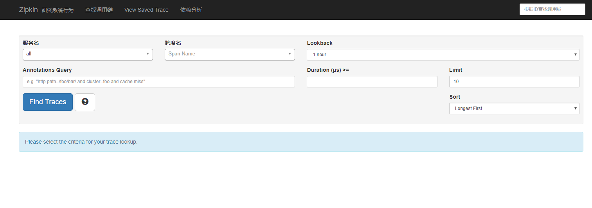
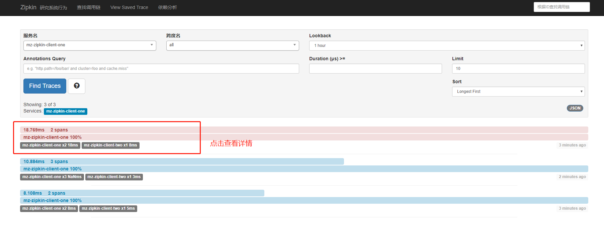

# Spring Cloud（九）Sleuth+ZipKin 实现服务追踪

注：本文Spring Cloud 版本 Finchley.SR1

## 为什么需要服务追踪

微服务架构是一个分布式架构，它按业务划分服务单元，一个分布式系统往往有很多个服务单元。由于服务单元数量众多，业务的复杂性，如果出现了错误和异常，很难去定位。主要体现在，一个请求可能需要调用很多个服务，而内部服务的调用复杂性，决定了问题难以定位。所以微服务架构中，必须实现分布式链路追踪，去跟进一个请求到底有哪些服务参与，参与的顺序又是怎样的，从而达到每个请求的步骤清晰可见，出了问题，很快定位。

举个例子，在微服务系统中，一个来自用户的请求，请求先达到前端A（如前端界面），然后通过远程调用，达到系统的中间件B、C（如负载均衡、网关等），最后达到后端服务D、E，后端经过一系列的业务逻辑计算最后将数据返回给用户。对于这样一个请求，经历了这么多个服务，怎么样将它的请求过程的数据记录下来呢？这就需要用到服务链路追踪。

作为Java全家桶的Spring当然也考虑到了这点，也已经为我们实现了链路追踪，也就是 Spring Cloud 的子项目 Spring Cloud Sleuth。 使用zipkin在收集到跟踪信息后将其聚合处理、存储、展示等，用户可通过web UI方便获得网络延迟、调用链路、系统依赖等等。

## 构建zipkin-server工程

新建一个工程，取名为`mz-zipkin-server`，引入Eureka的起步依赖spring-cloud-netflix-eureka-client，引入zipkin-server依赖，以及zipkin-autoconfigure-ui依赖，后两个依赖提供了Zipkin的功能和Zipkin界面展示的功能。代码如下：

#### 1、POM文件

```xml
<dependencies>
    <!--<dependency>
        <groupId>org.springframework.cloud</groupId>
        <artifactId>spring-cloud-netflix-eureka-client</artifactId>
    </dependency>-->
    <dependency>
        <groupId>org.springframework.boot</groupId>
        <artifactId>spring-boot-starter</artifactId>
    </dependency>
    <dependency>
        <groupId>io.zipkin.java</groupId>
        <artifactId>zipkin-server</artifactId>
        <version>${zipkin.version}</version>
    </dependency>
    <dependency>
        <groupId>io.zipkin.java</groupId>
        <artifactId>zipkin-autoconfigure-ui</artifactId>
        <version>${zipkin.version}</version>
    </dependency>
</dependencies>
```

#### 2、启动类（Application）

```
@EnableZipkinServer
@SpringBootApplication
public class ZipKinApplication {
    public static void main(String[] args) {
        SpringApplication.run(ZipKinApplication.class, args);
    }
}
```

#### 3、属性文件

```properties
server:
    port: 9411
spring:
    application:
        name: zipkin-server

management:
  metrics:
    web:
      server:
        auto-time-requests: false
```

这个时候 zipkinServer 便沟建好了，启动访问 <http://localhost:9411> 就能够看到zipkin页面。



## 改造 Client

我们在之前的项目 `mz-eureka-consumer-ribbon` 项目基础上复制两个项目  ` mz-zipkin-client-one` 和   ` mz-zipkin-client-two` ,加以改造

#### 1、引入依赖

```xml
<dependencies>
        <dependency>
            <groupId>org.springframework.cloud</groupId>
            <artifactId>spring-cloud-starter-netflix-eureka-client</artifactId>
        </dependency>
        <!-- Feign 依赖-->
        <dependency>
            <groupId>org.springframework.cloud</groupId>
            <artifactId>spring-cloud-starter-openfeign</artifactId>
        </dependency>
        <!-- ZipKin 依赖-->
        <dependency>
            <groupId>org.springframework.cloud</groupId>
            <artifactId>spring-cloud-starter-zipkin</artifactId>
        </dependency>
        <dependency>
            <groupId>org.springframework.boot</groupId>
            <artifactId>spring-boot-starter-web</artifactId>
        </dependency>
    </dependencies>
```

#### 2、增加配置

```properties
spring.zipkin.base-url=http://localhost:9411
spring.sleuth.sampler.probability=1.0

#注：spring.sleuth.sampler.percentage为1.0,即100%的概率将链路的数据上传给Zipkin Server，在默认的情况下，该值为0.1
```

#### 3、增加接口

增加接口两个项目互相调用，从而产生链路数据供我们查看，这里不再详细贴代码，可以参考项目。

```java
@RestController
public class HelloController {
    @Autowired
    RestTemplate restTemplate;
    @Autowired
    HelloFeign helloFeign;
    // restTemplate 调用
    @RequestMapping("rest")
    public String sayHiByRest() {
        return restTemplate.getForEntity("http://mz-zipkin-client-two/hi", String.class).getBody();
    }
	// feign 调用
    @RequestMapping("feign")
    public String sayHiByFeign() {
        return helloFeign.sayHi();
    }
	// 错误调用
    @RequestMapping("fail")
    public String error() {
        return restTemplate.getForEntity("http://mz-zipkin-client-two/hi2", String.class).getBody();
    }

}
```

## 测试

1、分别启动注册中心、Zuul 网关、ZipkinServer、以及上面的 client one  、client two

2、分别请求上面的三个接口产生链路数据

http://localhost:1004/mz-zipkin-client-one/rest

http://localhost:1004/mz-zipkin-client-one/feign

http://localhost:1004/mz-zipkin-client-one/fail

3、打开  <http://localhost:9411>  查看




