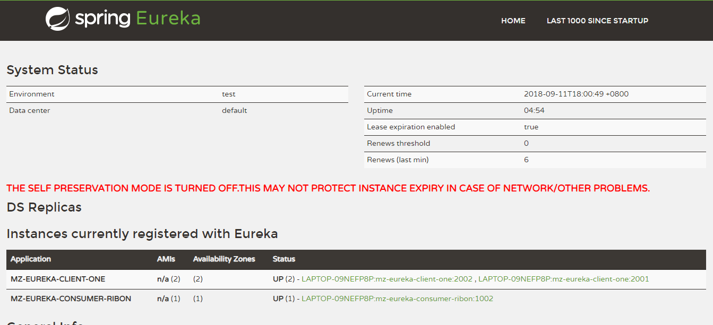

# Spring Cloud（二）客户端负载均衡Ribbon

## Ribbon

Ribbon是一个基于HTTP和TCP客户端的负载均衡器。Feign中也使用Ribbon，后续会介绍Feign的使用。

Ribbon可以在通过客户端中配置的ribbonServerList服务端列表去轮询访问以达到均衡负载的作用。

当Ribbon与Eureka联合使用时，ribbonServerList会被DiscoveryEnabledNIWSServerList重写，扩展成从Eureka注册中心中获取服务端列表。同时它也会用NIWSDiscoveryPing来取代IPing，它将职责委托给Eureka来确定服务端是否已经启动。

下面我们通过实例看看如何使用Ribbon来调用服务，并实现客户端的均衡负载。

### 准备工作：

	启动教程一服务注册与发现中的 mz-eureka-server 和 mz-eureka-client-one 

​	修改  mz-eureka-client-one 端口再次启动一个服务提供方。

	此时服务 application.name=mz-eureka-client-one 这个服务就有两个服务单元同时运行，可以在EurekaServer 中查看


### 使用Ribbon实现客户端负载均衡的消费者

构建一个基本Spring Boot项目 mz-eureka-consumer-ribbon，并在pom.xml中加入如下内容：

```xml
    <parent>
        <artifactId>SpringCloud-Learning</artifactId>
        <groupId>com.mz</groupId>
        <version>1.0.0</version>
    </parent>

    <dependencies>
        <dependency>
            <groupId>org.springframework.cloud</groupId>
            <artifactId>spring-cloud-starter-netflix-eureka-client</artifactId>
        </dependency>
        <!-- Ribbon 依赖-->
        <dependency>
            <groupId>org.springframework.cloud</groupId>
            <artifactId>spring-cloud-starter-netflix-ribbon</artifactId>
        </dependency>
        <dependency>
            <groupId>org.springframework.boot</groupId>
            <artifactId>spring-boot-starter-web</artifactId>
        </dependency>
    </dependencies>
```

在应用主类中，通过`@EnableDiscoveryClient`注解来添加发现服务能力。创建RestTemplate实例，并通过`@LoadBalanced`注解开启均衡负载能力。

```java
@SpringBootApplication
@EnableDiscoveryClient
public class RibbonApplication {
    @Bean
    @LoadBalanced
    RestTemplate restTemplate() {
        return new RestTemplate();
    }
    public static void main(String[] args) {
        SpringApplication.run(RibbonApplication.class, args);
    }
}
```

创建`HiController`来消费  `mz-eureka-client-one` 的hi服务。通过直接RestTemplate来调用服务。

```java
@RestController
public class HiController {
    @Autowired
    RestTemplate restTemplate;

    @GetMapping("/sayHi")
    public String dc() {
        return restTemplate.getForObject("http://mz-eureka-client-one/hi", String.class);
    }
}
```

bootstrap.yml`中配置eureka服务注册中心

```properties
eureka:
    client:
        serviceUrl:
            defaultZone: http://localhost:1001/eureka/
server:
    port: 1002
spring:
    application:
        name: mz-eureka-consumer-ribon
```

启动该应用，查看注册中心，效果如图



多次访问：<http://localhost:1002/sayHi> 能够看出每次调用的是不同端口的  `mz-eureka-client-one` 

到这里，我们已经通过Ribbon在客户端已经实现了对服务调用的均衡负载。
