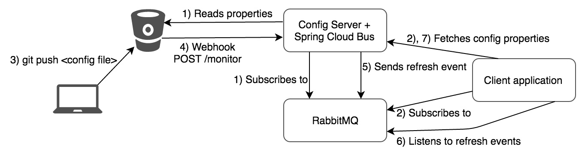
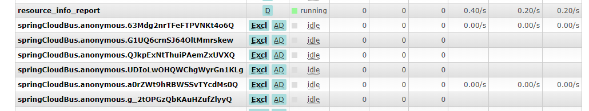
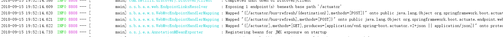

# Spring Cloud（五）消息总线BUS

本章依赖于 [Spring Cloud(四) 配置中心Config](./Spring Cloud（四）配置中心Config.md) ,请没有构建好配置中心的出门左拐

前面一节，我们已经成功的构建了配置中心，如果需要客户端获取到最新的配置信息需要执行`refresh`，我们可以利用 Webhook 的机制每次提交代码发送请求来刷新客户端，当客户端越来越多的时候，需要每个客户端都执行一遍，这种方案就不太适合了。使用 Spring Cloud Bus 可以完美解决这一问题。

# Spring Cloud Bus

Spring Cloud Bus 通过轻量消息代理连接各个分布的节点。这会用在广播状态的变化（例如配置变化）或者其他的消息指令。Spring Bus 的一个核心思想是通过分布式的启动器对 Spring Boot 应用进行扩展，也可以用来建立一个多个应用之间的通信频道。目前唯一实现的方式是用 Amqp 消息代理作为通道，同样特性的设置（有些取决于通道的设置）在更多通道的文档中。

Spring Cloud Bus 被国内很多都翻译为消息总线，也挺形象的。大家可以将它理解为管理和传播所有分布式项目中的消息既可，其实本质是利用了 MQ 的广播机制在分布式的系统中传播消息，目前常用的有 Kafka 和 RabbitMQ。利用 Bus 的机制可以做很多的事情，其中配置中心客户端刷新就是典型的应用场景之一，我们用一张图来描述 Bus 在配置中心使用的机制。




### 升级 Config Server 端

为了防止整合到后面依赖过多，不好理解，因此在之前 `mz-config-server-mysql` 的基础上复制一个项目 `mz-config-server-bus` ,除项目名、service_id外，其他配置完全相同。引入 `spring-cloud-starter-bus-amqp` 依赖， POM 依赖如下：

```xml
<dependencies>
        <dependency>
            <groupId>org.springframework.cloud</groupId>
            <artifactId>spring-cloud-starter-netflix-eureka-client</artifactId>
        </dependency>
        <!-- 配置中心Server-->
        <dependency>
            <groupId>org.springframework.cloud</groupId>
            <artifactId>spring-cloud-config-server</artifactId>
        </dependency>
        <!-- 消息总线 RabbitMQ-->
        <dependency>
            <groupId>org.springframework.cloud</groupId>
            <artifactId>spring-cloud-starter-bus-amqp</artifactId>
        </dependency>
        <dependency>
            <groupId>org.springframework.boot</groupId>
            <artifactId>spring-boot-starter-jdbc</artifactId>
        </dependency>
        <dependency>
            <groupId>mysql</groupId>
            <artifactId>mysql-connector-java</artifactId>
            <version>5.1.21</version>
        </dependency>
    </dependencies>
```

配置文件增加 RabbitMQ 依赖：

```properties

```

### 升级 Client 

为了防止整合到后面依赖过多，不好理解，因此在之前 `mz-eureka-consumer-one` 的基础上复制一个项目 `mz-eureka-consumer-bus` ,除项目名、service_id外，其他配置完全相同。引入 `spring-cloud-starter-bus-amqp` 依赖， POM 依赖如下：

```xml
<dependencies>
        <dependency>
            <groupId>org.springframework.cloud</groupId>
            <artifactId>spring-cloud-starter-netflix-eureka-client</artifactId>
        </dependency>
        <dependency>
            <groupId>org.springframework.cloud</groupId>
            <artifactId>spring-cloud-starter-config</artifactId>
        </dependency>
        <dependency>
            <groupId>org.springframework.cloud</groupId>
            <artifactId>spring-cloud-starter-bus-amqp</artifactId>
        </dependency>
        <dependency>
            <groupId>org.springframework.boot</groupId>
            <artifactId>spring-boot-starter-web</artifactId>
        </dependency>
    </dependencies>
```

配置文件如下：

增加MQ配置以及暴露/actuator/bus-refresh这个 Endpoint

```properties
spring:
    application:
        name: mz-eureka-client-bus
    cloud:
        config:
            discovery:
                enabled: true
                service-id: mz-config-server-bus
                #uri: http://localhost:8888/
            label: master
            profile: test
        bus:
            enabled: true
            trace:
                enabled: true
    rabbitmq:
        host: 192.168.0.223
        password: admin
        port: 5672
        username: admin

#Spring Boot 1.5.X 以上默认开通了安全认证，
#所以要在配置文件 application.yml 中添加以下配置以将/actuator/bus-refresh这个 Endpoint 暴露出来
management:
    endpoints:
        web:
            exposure:
                include: bus-refresh

```

### 测试


改造完之后，我们依次启动注册中心、配置中心以及客户端

启动后，RabbitMQ 中会自动创建一个 topic 类型的 Exchange 和两个以`springCloudBus.anonymous.`开头的匿名 Queue:



同时观察客户端启动日志，可以看见如下信息：



我们以 POST 请求的方式来访问 <http://localhost:2001/actuator/bus-refresh> 就会更新配置文件至最新版本。

测试流程：

1. 访问 <http://localhost:2001/hi> 返回`Hi Spring Cloud, running in port :2001 info.message is : i am config by jdbc`
2. 我将 Git 上对应配置文件里的值改为`i am config by jdbc update `
3. 发送 Post 请求到 `http://localhost:2001/actuator/bus-refresh`
4. 访问 <http://localhost:2001/hi> 返回`Hi Spring Cloud, running in port :2001 info.message is : i am config by jdbc update`

