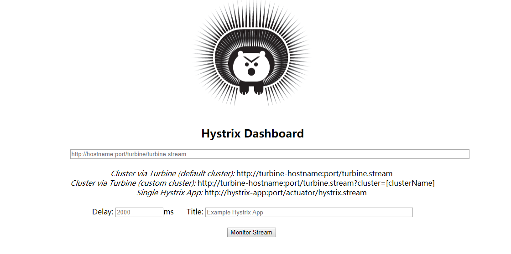

# Spring Cloud（八）熔断监控Hystrix Dashboard和Turbine


前一节，我们已经成功的配置了熔断器，但是在实际应用中，单纯的熔断不能满足我们的需求，我们不止需要保证一个业务宕机不影响其他服务，同时也需要有监控能够知道服务情况，从而即时发现、解决问题，这一节我们就通过 Hystrix Dashboard和Turbine 完成这个功能。

## Hystrix Dashboard 和 Turbine

Hystrix-dashboard是一款针对Hystrix进行实时监控的工具，通过Hystrix Dashboard我们可以在直观地看到各Hystrix Command的请求响应时间, 请求成功率等数据。但是只使用Hystrix Dashboard的话, 你只能看到单个应用内的服务信息, 这明显不够. 我们需要一个工具能让我们汇总系统内多个服务的数据并显示到Hystrix Dashboard上, 这个工具就是Turbine. 

## Hystrix Dashboard

Hystrix Dashboard 的示例项目我们在之前的 `mz-eureka-consumer-ribbon` 项目上进行改造，首先创建 `mz-consumer-hystrix-dashboard` 将之前项目的代码、配置、依赖全部 copy 过来，然后进行改造：

### 1、添加依赖

```xml
<dependency>
    <groupId>org.springframework.cloud</groupId>
    <artifactId>spring-cloud-starter-netflix-hystrix-dashboard</artifactId>
</dependency>
<dependency>
    <groupId>org.springframework.cloud</groupId>
    <artifactId>spring-cloud-starter-netflix-hystrix</artifactId>
</dependency>
```

### 2、启动类

启动类添加启用Hystrix Dashboard和熔断器

```java
@SpringBootApplication
@EnableDiscoveryClient
@EnableFeignClients
@EnableHystrixDashboard
@EnableCircuitBreaker
public class HystrixDashBoardApplication {
    @Bean
    @LoadBalanced
    public RestTemplate restTemplate() {
        return new RestTemplate();
    }

    public static void main(String[] args) {
        SpringApplication.run(HystrixDashBoardApplication.class, args);
    }

}
```

### 3、修改配置，公开必须端点

```properties
management:
    endpoints:
        web:
            exposure:
                include: hystrix.stream, info, health
```

### 4、测试

依次启动注册中心以及本次构建的项目：启动后访问 http://localhost:1005/hystrix ，将会看到如下界面：



图中会有一些提示：

> Cluster via Turbine (default cluster): http://turbine-hostname:port/turbine.stream 
> Cluster via Turbine (custom cluster): http://turbine-hostname:port/turbine.stream?cluster=[clusterName]
> Single Hystrix App: http://hystrix-app:port/hystrix.stream

大概意思就是如果查看默认集群使用第一个url,查看指定集群使用第二个url,单个应用的监控使用最后一个，我们暂时只演示单个应用的所以在输入框中输入： http://localhost:1005/hystrix.stream ，输入之后点击 monitor，进入页面。

如果没有请求会先显示`Loading ...`

请求之前加了熔断的接口： http://localhost:1005/hello

再次查看 Hystrix Dashboard 页面：


页面各个参数描述如下：


## Turbine

在复杂的分布式系统中，相同服务的节点经常需要部署上百甚至上千个，很多时候，运维人员希望能够把相同服务的节点状态以一个整体集群的形式展现出来，这样可以更好的把握整个系统的状态。 为此，Netflix提供了一个开源项目（Turbine）来提供把多个hystrix.stream的内容聚合为一个数据源供Dashboard展示。

### 改造Server端

对上一步的项目   `mz-consumer-hystrix-dashboard`  进行改造即可：

1、增加POM依赖

```xml
<dependency>
    <groupId>org.springframework.cloud</groupId>
    <artifactId>spring-cloud-starter-netflix-turbine</artifactId>
</dependency>
```

2、开启服务

启动类上添加 @EnableTurbine 注解开启Turbine

3、修改配置文件

```properties
turbine:
    appConfig: mz-consumer-hystrix-client-1,mz-consumer-hystrix-client-2 #这一项为 turbine 需要查看的 service
    clusterNameExpression: new String("default")
```


### 改造 Client 

Client 在之前 `mz-eureka-consumer-ribbon` 项目上进行改造，首先创建 `mz-consumer-hystrix-client` 将之前项目的代码、配置、依赖全部 copy 过来，然后进行改造：

1、POM 依赖如下：

```xml
<dependencies>
    <dependency>
        <groupId>org.springframework.cloud</groupId>
        <artifactId>spring-cloud-starter-netflix-eureka-client</artifactId>
    </dependency>
    <!-- 客户端负载均衡 Ribbon 依赖-->
    <dependency>
        <groupId>org.springframework.cloud</groupId>
        <artifactId>spring-cloud-starter-netflix-ribbon</artifactId>
    </dependency>
    <!-- Feign 依赖-->
    <dependency>
        <groupId>org.springframework.cloud</groupId>
        <artifactId>spring-cloud-starter-openfeign</artifactId>
    </dependency>
    <!-- hystrix 依赖-->
    <dependency>
        <groupId>org.springframework.cloud</groupId>
        <artifactId>spring-cloud-starter-netflix-hystrix</artifactId>
    </dependency>
    <dependency>
        <groupId>org.springframework.cloud</groupId>
        <artifactId>spring-cloud-starter-netflix-turbine</artifactId>
    </dependency>
    <dependency>
        <groupId>org.springframework.boot</groupId>
        <artifactId>spring-boot-starter-web</artifactId>
    </dependency>
</dependencies>
```

2、配置如下：

```properties
eureka:
    client:
        serviceUrl:
            defaultZone: http://localhost:1001/eureka/
server:
    port: 1007
spring:
    application:
        name: mz-consumer-hystrix-client-2
feign:
    hystrix:
        enabled: true

management:
    endpoint:
        hystrix:
            stream:
                enabled: true  # 启用hystrix
    endpoints:
        web:
            exposure:
                include: hystrix.stream, info, health
```

3、启动类添加@EnableCircuitBreaker

```java
@EnableDiscoveryClient
@SpringBootApplication
@EnableFeignClients
@EnableCircuitBreaker
public class EurekaRibbonApplication {
    @Bean
    @LoadBalanced
    public RestTemplate restTemplate() {
        return new RestTemplate();
    }
    public static void main(String[] args) {
        SpringApplication.run(EurekaRibbonApplication.class, args);
    }

}
```

**测试：**

1、依次启动注册中心、`mz-consumer-hystrix-dashboard`  

2、启动两个 clent `mz-consumer-hystrix-client`  分别使用 1006、1007 端口，spring.application.name 分别为 mz-consumer-hystrix-client-1、 mz-consumer-hystrix-client-2

3、依次调用 http://localhost:1006/hello、 http://localhost:1007/hello

4、访问 http://localhost:1005/hystrix 

5、输入 http://localhost:1005/turbine.stream 点击 Monitor Stream 查看结果。


### 


