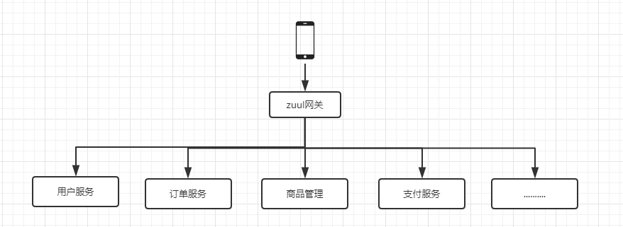

# Spring Cloud（六）服务网关zuul


## **为什么要使用微服务网关**

不同的微服务网关一般都会有不同的网络地址，而外部客户端（例如手机APP）可能需要调用多个服务的接口才能完成一个业务需求。例如一个常见的电商平台APP，可能会调用多个微服务的接口，才能完成一次购物的业务流程，如下图：


如果让客户端直接与各个微服务通信，会有以下问题：

​	1 客户端多次请求不同的微服务，增加了客户端的复杂性。

​	2 存在跨域请求，在一定的场景下处理相对复杂。

​	3 认证复杂，每个微服务都需要独立认证。

​	4 难以重构，随着项目的迭代，可能需要重新划分微服务。例如，可能将多个微服务合并成一个或者将一个微服务拆分成多个。如果客户端直接与微服务通信，那么重构将会很能实施。

​	5 某些微服务可能使用了防火墙/浏览器不友好的协议，直接访问会有一定困难。

以上问题可借助微服务网关解决。微服务网络是介于客户端和服务端之间的中间层，所有的外部请求都会先经过微服务网关。使用微服务网关后的架构如下：



如上图，微服务网关封装了应用程序的内部结构，客户端只须跟网关交互，而无须直接调用特定微服务的接口。这样开发就可以得到简化。不仅如此，使用微服务网关还有以下优点：

​	1 易于监控。可在微服务网关收集监控数据并将其推送到外部系统进行分析。

​	2 易于认证。可在微服务网关上进行认证，然后再将请求转发到后端的微服务，而无须在每个微服务上进行认证。

​	3 减少了客户端与各个微服务之间的交互次数。

## **Zuul简介**

Zuul是Netflix开源的微服务网关，它可以和Eureka、Ribbon、hystrix等组件配合使用。Zuul的核心是一系列过滤器。这些过滤器完成以下功能：

​	1 身份认证和安全：识别每个资源的验证要求，并拒绝那些与要求不符的请求。

​	2 审查与监控：在边缘位置追踪有意义的数据和统计结果，从而带来精确的生产视图。

​	3 动态路由：动态地将请求路由到不同的后端集群。

​	4 压力测试：逐渐增加指向集群的流量，以了解性能。

​	5 负责分配：为每一种负载类型分配对应容量，并弃用超出限定值的请求。

​	6 静态响应处理：在边缘位置直接建立部分响应，避免其转发到内部集群。

​	7 多区域弹性：跨越AWS Region进行请求路由，旨在实现ELB（Elastic Load Blancing）使用的多样化，以及让系统的边缘更贴近系统的使用者。

Spring Cloud对Zuul进行了整合与增强。目前，Zuul使用默认HTTP客户端是Apache HTTP Client，也可使用RestClient或okhttp3.OkHttpClient。如果想要使用RestClient，可以设置ribbon .restclient.enabled=true；想要使用okhttp3.OkHttpClient，可以设置ribbon.okhttp.enabled=true。

## 构建服务

网关服务特别简单，构建一个新的 SpringBoot 项目，引入网关依赖，开启网关即可。

下面我们在 SpringCloud-Learning 项目下创建一个 Model，`mz-api-gateway-zuul` ,引入对应依赖，POM 如下：

```xml

```

启动类开启服务：

```java

```

创建 `bootstrap.xml` 的配置文件，完成网关配置：

```properties
spring:
  application:
    name: service-cart-zuul

server:
  port: 1004

eureka:
  client:   
  	#间隔多长时间再次获取注册表
    registry-fetch-interval-seconds: 10
    #网关是否注册进注册中心这里选择的否
    register-with-eureka: false  
    #fetch注册到注册中心的服务必须是 true
    fetch-registry: true
    serviceUrl:
      defaultZone: http://localhost:1001/eureka/
```

**测试**：

以此启动之前的 `mz-eureka-server`注册中心、`mz-config-serve-git`配置中心、`mz-eureka-consumer-ribbon`消费者，`mz-config-consumer-one`消费者，以及我们刚刚构建的网关服务。

访问 localhost:1004/服务serviceId/接口 验证。 例如：http://localhost:1004/mz-eureka-consumer-ribon/hi

## 服务路由配置

服务路由我们在上一篇中也已经有过基础的介绍和体验，Spring Cloud Zuul通过与Spring Cloud Eureka的整合，实现了对服务实例的自动化维护，所以在使用服务路由配置的时候，我们不需要向传统路由配置方式那样为`serviceId`去指定具体的服务实例地址，只需要通过一组`zuul.routes.<route>.path`与`zuul.routes.<route>.serviceId`参数对的方式配置即可。

比如下面的示例，它实现了对符合`/ribbon/**`规则的请求路径转发到名为`mz-eureka-consumer-ribon`的服务实例上去的路由规则。其中`<route>`可以指定为任意的路由名称。例如：

```properties

```

在Spring Cloud Netflix中，Zuul巧妙的整合了Eureka来实现面向服务的路由。实际上，我们可以直接将API网关也看做是Eureka服务治理下的一个普通微服务应用。它除了会将自己注册到Eureka服务注册中心上之外，也会从注册中心获取所有服务以及它们的实例清单。所以，在Eureka的帮助下，API网关服务本身就已经维护了系统中所有serviceId与实例地址的映射关系。当有外部请求到达API网关的时候，根据请求的URL路径找到最佳匹配的`path`规则，API网关就可以知道要将该请求路由到哪个具体的`serviceId`上去。由于在API网关中已经知道`serviceId`对应服务实例的地址清单，那么只需要通过Ribbon的负载均衡策略，直接在这些清单中选择一个具体的实例进行转发就能完成路由工作了。