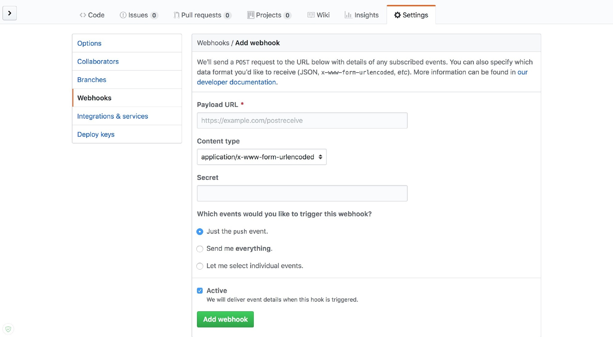

# Spring Cloud（四）配置中心Config

在分布式系统中，由于服务数量巨多，为了方便服务配置文件统一管理，实时更新，所以需要分布式配置中心组件。在Spring Cloud中，有分布式配置中心组件spring cloud config ，它支持配置服务放在配置服务的内存中（即本地），也支持放在远程Git仓库以及数据库中。在spring cloud config 组件中，分两个角色，一是config server，二是config client。

在本文中，我们将分别构建基于Git、基于Mysql 数据库存储的分布式配置中心，并对客户端进行改造，并让其能够从配置中心获取配置信息并绑定到代码中的整个过程。


## 基于GIT存储

### 理解配置中心搜索路径

```
配置信息的URL与配置文件的映射关系如下：

- /{application}/{profile}[/{label}]
- /{application}-{profile}.yml
- /{label}/{application}-{profile}.yml
- /{application}-{profile}.properties
- /{label}/{application}-{profile}.properties
```

### 准备配置仓库

在这里，我在 Gitee 上创建了一个公开的 repo,  [config-repo-demo](https://gitee.com/mrzhouy/config-repo-demo) 里面创建 `mz-eureka-client-one` 的文件夹，存放  `mz-eureka-client-one` 项目的配置文件。地址：https://gitee.com/mrzhouy/config-repo-demo

### 构建 Server 端

创建一个 SpringBoot 的基础项目 `mz-config-server-git` ,同时引入 config 的依赖 spring-cloud-config-server

POM 文件如下：

```xml
 <dependencies>
        <dependency>
            <groupId>org.springframework.cloud</groupId>
            <artifactId>spring-cloud-starter-netflix-eureka-client</artifactId>
        </dependency>
        <dependency>
            <groupId>org.springframework.cloud</groupId>
            <artifactId>spring-cloud-config-server</artifactId>
        </dependency>
    </dependencies>
```

创建项目配置文件 `bootstarp.yml` , 配置如下：

```properties
eureka:
    client:
        serviceUrl:
            defaultZone: http://localhost:1001/eureka/
server:
    port: 1003
spring:
    application:
        name: mz-config-server-git
    cloud:
        config:
            server:
                git:
                    searchPaths: '{application}'
                    uri: https://gitee.com/mrzhouy/config-repo-demo
```

spring clour config git 属性解释：

```properties
uri: 仓库地址
username:访问账号（私库才需要输入）
password:账号密码（私库才需要输入）
searchPaths:git仓库子目录
```

当然，在某些时候我们希望对不同的子项目访问不同的git仓目录,因此我们可以在使用如下配置:

```properties
searchPaths: '{application}'

注：config 客户端在没有 spring.cloud.config.name属性的时候，服务端{application} 获取的是客户端 
spring.application.name的值，否则，获取的是 spring.cloud.config.name的值。 
1）、当没有spring.cloud.config.name时，客户端获取的是spring.application.name 所对应的git库中的文件，并且只能获取一个文件， 
2）、当一个项目中有需求要获取多个文件时，就需要用到spring.cloud.config.name这个属性，以逗号分割
```

#### 开启服务

启动类上添加 @EnableConfigServer 注解开启 config server 服务。代码如下：

```java
@EnableDiscoveryClient
@EnableConfigServer
@SpringBootApplication
public class ConfigServerApplication  extends SpringBootServletInitializer {
    public static void main(String[] args) {
        SpringApplication.run(ConfigServerApplication.class, args);
    }

    @Override
    protected SpringApplicationBuilder configure(SpringApplicationBuilder builder) {
        return builder.sources(ConfigServerApplication.class);
    }
}
```

### 升级客户端（client）

客户端这里，我们直接在之前的 `mz-eureka-client-one` 项目中进行升级。

添加config依赖：

```x&#39;m&#39;l
<dependency>
   <groupId>org.springframework.cloud</groupId>
   <artifactId>spring-cloud-starter-config</artifactId>
</dependency>
```

修改配置文件  `bootstarp.yml` 添加 config 配置：

```properties
spring:
    cloud:
        config:
            discovery:
                enabled: true
                service-id: mz-config-server-git
                #uri: http://localhost:8888/
            label: master
            profile: test
    
#注：如果config server 没有注入到注册中心，我们在这里可以通过 uri 来指定配置中心地址。但是生产、测试、开发环境中，我的配置中心是多个，因此我是将配置中心注册到了注册中心，通过 service-id 来访问注册中心的。
```

改造 HelloController:

```java
@RestController
public class HelloController {
    @Value("${server.port}")
    private String serverPort;
    @Value("${info.message}")
    private String infoMessage;
    @RequestMapping("hi")
    public String sayHi() {
        return "Hi Spring Cloud, running in port :" + serverPort + "     info.message is : " + infoMessage;
    }
}
```

至此，配置中心已经构建完成，按顺序启动 注册中心、配置中心 、客户端。  调用 http://localhost:2001/hi ，我们可以看到通过配置中心拿到的  info.message 这个值。


基于 MySql 存储

前面我们已经完成了基于 GIT 存储的配置中心，其实升级为mysql存储很简单。只需要修改 POM 依赖（引入数据库依赖），以及 bootstarp.yml 属性文件即可。在这里，我们创建新的项目  `mz-config-server-mysql` ,POM 文件如下： 

```xml
<parent>
        <artifactId>SpringCloud-Learning</artifactId>
        <groupId>com.mz</groupId>
        <version>1.0.0</version>
    </parent>
    <modelVersion>4.0.0</modelVersion>

    <artifactId>mz-config-server-mysql</artifactId>
    <description>Spring Cloud 配置中心——MySql</description>

    <dependencies>
        <dependency>
            <groupId>org.springframework.cloud</groupId>
            <artifactId>spring-cloud-starter-netflix-eureka-client</artifactId>
        </dependency>
        <dependency>
            <groupId>org.springframework.cloud</groupId>
            <artifactId>spring-cloud-config-server</artifactId>
        </dependency>
        <!-- 引入数据库依赖-->
        <dependency>
            <groupId>org.springframework.boot</groupId>
            <artifactId>spring-boot-starter-jdbc</artifactId>
        </dependency>
        <dependency>
            <groupId>mysql</groupId>
            <artifactId>mysql-connector-java</artifactId>
            <version>5.1.21</version>
        </dependency>
    </dependencies>
```

修改   `bootstarp.yml`  ：

指定 spring.profiles.active = jdbc,然后增加 jdbc配置

```properties
eureka:
    client:
        serviceUrl:
            defaultZone: http://localhost:1001/eureka/
server:
    port: 1003
spring:
    application:
        name: mz-config-server-mysql
    profiles:
        active: jdbc
    cloud:
        config:
            label: master
            server:
                jdbc:
                    sql: SELECT `KEY`, `VALUE` from PROPERTIES where APPLICATION=? and PROFILE=? and LABEL=?
    datasource:
        driver-class-name: com.mysql.jdbc.Driver
        url: jdbc:mysql://127.0.0.1:3306/db_microserver_config
        username: root
        password: TW123

```

创建数据库的sql 文件在项目中：ConfigMySql.sql

至此，修改完成，按顺序启动 注册中心、配置中心 、客户端(记得修改配置中心的serverId哦)。  调用 http://localhost:2001/hi ，我们可以看到通过配置中心拿到的  info.message 这个值。


## Refresh

上面我们成功的完成了配置中心，但是这个时候就产生了疑问，client是在项目启动的时候就请求了配置中心，获取到了配置，如图：


那再我们修改完配置中心的配置后，如何刷新配置呢。如果需要重启项目的话，配置中心就会显得比较鸡肋。

别急，spring cloud 当然为我们提供了刷新的办法。仅修改客户端即 mz-eureka-client-one 项目，就可以实现 refresh 的功能。

### 添加依赖

```
<dependency>
    <groupId>org.springframework.boot</groupId>
    <artifactId>spring-boot-starter-actuator</artifactId>
</dependency>
```

增加了`spring-boot-starter-actuator`包，`spring-boot-starter-actuator`是一套监控的功能，可以监控程序在运行时状态，其中就包括`/actuator/refresh`的功能。

### 开启更新机制

需要给加载变量的类上面加载`@RefreshScope`，在客户端执行`/actuator/refresh`的时候就会更新此类下面的变量值。

```java
@RestController
@RefreshScope
public class HelloController {
    @Value("${server.port}")
    private String serverPort;
    @Value("${info.message}")
    private String infoMessage;
    @RequestMapping("hi")
    public String sayHi() {
        return "Hi Spring Cloud, running in port :" + serverPort + "     info.message is : " + infoMessage;
    }
}
```

### 配置

Spring Boot 1.5.X 以上默认开通了安全认证，所以要在配置文件 application.yml 中添加以下配置以将`/actuator/refresh`这个 Endpoint 暴露出来

```properties
management:
  endpoints:
    web:
      exposure:
        include: refresh
```

### 测试

改造完之后，我们重启 mz-eureka-consumer-one，我们以 POST 请求的方式来访问 <http://localhost:2001/actuator/refresh> 就会更新配置文件至最新版本。

测试流程：

1. 访问 <http://localhost:2001/hi> 返回`Hi Spring Cloud, running in port :2001 info.message is : i am config by jdbc`
2. 我将 Git 上对应配置文件里的值改为`i am config by jdbc update `
3. 发送 Post 请求到 `http://localhost:2001/actuator/refresh`
4. 访问 <http://localhost:2001/hi> 返回`Hi Spring Cloud, running in port :2001 info.message is : i am config by jdbc update`

不过，每次手动刷新客户端也很麻烦，有没有什么办法只要提交代码就自动调用客户端来更新呢，Github 的 Webhook 是一个办法。

### Webhook

Webhook 是当某个事件发生时，通过发送 HTTP POST 请求的方式来通知信息接收方。Webhook 来监测你在 Github.com 上的各种事件，最常见的莫过于 push 事件。如果你设置了一个监测 push 事件的 Webhook，那么每当你的这个项目有了任何提交，这个 Webhook 都会被触发，这时 Github 就会发送一个 HTTP POST 请求到你配置好的地址。

如此一来，你就可以通过这种方式去自动完成一些重复性工作，比如，你可以用 Webhook 来自动触发一些持续集成（CI）工具的运作，比如 Travis CI；又或者是通过 Webhook 去部署你的线上服务器。下图就是 Github 上面的 Webhook 配置。



- `Payload URL` ：触发后回调的 URL
- `Content type` ：数据格式，两种一般使用 json
- `Secret` ：用作给 POST 的 body 加密的字符串。采用 HMAC 算法
- `events` ：触发的事件列表。

| events 事件类型 | 描述                         |
| --------------- | ---------------------------- |
| push            | 仓库有 push 时触发。默认事件 |
| create          | 当有分支或标签被创建时触发   |
| delete          | 当有分支或标签被删除时触发   |

这样我们就可以利用 hook 的机制去触发客户端的更新，但是当客户端越来越多的时候，hook 机制也不够优雅了，另外每次增加客户端都需要改动 hook 也是不现实的。其实，Spring Cloud 给了我们更好解决方案——Spring Cloud Bus。后续我们将继续学习如何通过 Spring Cloud Bus 来实现以消息总线的方式进行通知配置信息的变化，完成集群上的自动化更新。